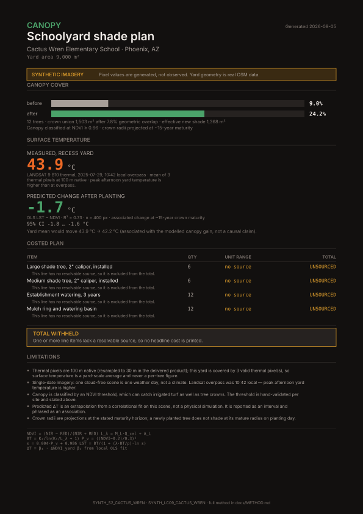
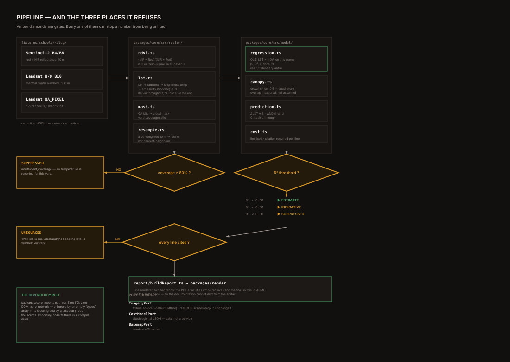

# 🌳 Canopy

**▶ Live demo: `<DEPLOY_URL>`**

[](https://github.com/skodityala/canopy/actions/workflows/ci.yml)


**Satellite-measured schoolyard tree canopy and surface temperature, turned into a
costed planting plan with a predicted temperature drop.**

Canopy reads a schoolyard's vegetation from Sentinel-2 and its surface temperature
from Landsat, fits the local relationship between them on that scene's own pixels,
and produces the one-page costed document a facilities office can act on.

**Every number carries its method. When the data cannot support a claim, Canopy
withholds it and says why.** That refusal is enforced by the type system, not by
convention — there is no code path that prints an unsupported number, because such
a path would not compile.



---

## The 20-second version

```
  yard:      Cactus Wren Elementary, Phoenix AZ  —  9,000 m² recess yard
  measured:  existing canopy  9.0%   ·   yard-mean LST  43.9 °C  (n = 3 px)
  proposed:  12 trees, 6 large + 6 medium  ·  canopy → 24.2%  (+15.2 pts)

  ┌─ PREDICTION ─────────────────────────────────────── ⬤ ESTIMATE ─┐
  │  ΔT  −1.74 °C       95% CI [−1.84, −1.64]        R² = 0.730      │
  │                                                                  │
  │  fitted on this scene's own 400 thermal pixels, not a            │
  │  literature constant. "associated with", not "will cause".       │
  │  projection at ~15-year crown maturity.                          │
  └──────────────────────────────────────────────────────────────────┘

  cost:      $8,544 – $11,328   ·   every line cited to Portland Title 11
```

Reproduce every figure above:

```bash
npx vite-node tools/ingest/src/report.ts
```

---

## What makes this different

The competing thing is not another satellite tool. It is **a tool that always
gives you a number.**

```
                                  conventional tool        Canopy
  ═══════════════════════════════════════════════════════════════════════════
  clear scene, good fit           number                   number
  ───────────────────────────────────────────────────────────────────────────
  50% cloud over the yard         number  ✗ WRONG          REFUSED
                                  averages the survivors   coverage 50% < 80%
  ───────────────────────────────────────────────────────────────────────────
  R² = 0.21 local fit             number  ✗ WRONG          SUPPRESSED
                                  reports it anyway        below the 0.30 gate
  ───────────────────────────────────────────────────────────────────────────
  no published regional price      number  ✗ INVENTED       UNSOURCED
                                  plausible guess          total withheld
  ───────────────────────────────────────────────────────────────────────────
  unclassified cost line           number  ✗ INVENTED       excluded from total
  ═══════════════════════════════════════════════════════════════════════════
```

A caveat is not read. A number, once printed, gets quoted — without its warning.
The only way to stop a bad number being cited is to not print it.

> **A number a skeptic can puncture is worse than no number.**
> One fabricated figure discards the whole document in the eyes of the person who
> caught it.

**And the refusal is partial, which is the part that takes work.** When ΔT is
withheld, canopy % and the costed plan still render — those are still measured. The
gate withholds exactly the unsupported claim and nothing else.

---

## All four schools, from one real run

```
  SCHOOL          YARD m²  CANOPY         LST °C   n   COV     R²      ΔT
  ═══════════════════════════════════════════════════════════════════════════════
  cactus-wren       9,000   9.0% → 24.2%   43.9    3   100%   0.730   −1.74  ESTIMATE
  john-jacobs       9,000  24.2% → 37.0%   40.9    2   100%   0.618   −1.11  ESTIMATE
  sunridge          9,000  55.4% → 63.0%   37.0    2   100%   0.557   −0.58  ESTIMATE
  dos-rios          9,000  11.6% → 26.4%   42.6    1    50%   0.708      ⛔  SUPPRESSED
  ═══════════════════════════════════════════════════════════════════════════════
  identical 12-tree plan on every site, so differences are the site, not the plan
  source: npx vite-node tools/ingest/src/report.ts
```

**Read the `dos-rios` row twice.** Its R² of 0.708 is the *second-best fit of the
four* — and it is still refused, because only 50% of its yard is cloud-free. A tool
that suppresses when its model is bad is ordinary. Suppressing when the model is
fine but the input coverage is not is the harder behaviour, and the one that
matters.

**And `sunridge` is the row that proves this measures rather than sells trees.**
Already 55.4% shaded, it gets the smallest recommendation of the four: +7.6 points
against cactus-wren's +15.2, and −0.58 °C against −1.74 °C. Identical crown area,
but only 683 m² of *effective* new shade, because half the new crowns land on
ground already in shade.

```
  CANOPY GAIN vs EXISTING CANOPY — the tool correctly recommends less
  where less is needed

  cactus-wren   9.0% ████░░░░░░░░░░░░░░░░  →  24.2%  ██████████░░░░░░░░░░  +15.2
  dos-rios     11.6% █████░░░░░░░░░░░░░░░  →  26.4%  ███████████░░░░░░░░░  +14.8
  john-jacobs  24.2% ██████████░░░░░░░░░░  →  37.0%  ███████████████░░░░░  +12.8
  sunridge     55.4% ██████████████████████ → 63.0%  █████████████████████  +7.6
                                                                            ▲
                                                          smallest gain where
                                                          the yard is already shaded
```

---

## The fit behind the number

This is the machine-learning core: an ordinary least squares regression, refitted
**live on every scene**, never a borrowed constant.

```
  LST vs NDVI  ·  cactus-wren  ·  n = 400 cloud-free thermal cells
  density:  .  none    1 low    2    3    4 high        █ fitted OLS line

  LST °C
   45.1 │.1.1....................
   44.9 │.221....................
   44.8 │1█432.111...............
   44.6 │222█32321.1.............
   44.5 │.1224█43.21..1..........
   44.3 │221144█3441122..........
   44.1 │....234█3344122.........
   44.0 │....21232█3332.2........
   43.8 │.....13.32█23241311..1..
   43.7 │..1......214█1322122....
   43.5 │...........11223█223212.
   43.4 │............12.222█3321.
   43.2 │.............111.1221█1.
   43.0 │...............1..1213.█
        └────┬─────┬─────┬─────┬──
           0.10  0.13  0.16  0.20         NDVI
  ───────────────────────────────────────────────────────────────────────────
    β₁  = −15.93 °C per NDVI unit        R²     = 0.730
    β₀  =  46.29 °C                      n      = 400 cells
    SE  =   0.485                        95% CI = [−16.88, −14.98]
  ───────────────────────────────────────────────────────────────────────────
  source: npx vite-node tools/ingest/src/diagnose.ts
```

Why refit instead of looking up a published figure: urban-cooling constants vary by
an order of magnitude across climates. A borrowed number fails the first informed
question — *which study, which city, why does it apply here?* — and would give the
same answer for a desert schoolyard and a Portland one.

Refitting also means the model **can fail**, which is useful. A borrowed constant
never tells you the relationship is unresolvable at your site.

### The confidence interval is real

`t(0.975, n−2)` computed from the regularised incomplete beta function, not a
hardcoded 1.96. Verified against published tables:

```
  df         COMPUTED    PUBLISHED    Δ
  ─────────────────────────────────────────
     1        12.7062      12.706     0.0002
     5         2.5706       2.571     0.0004
    30         2.0423       2.042     0.0003
   120         1.9799       1.980     0.0001
  1000         1.9623       1.962     0.0003
  ─────────────────────────────────────────
  → 1.96 as df → ∞, as it must
```

At n = 400 this buys almost nothing numerically. It buys a correct answer to "where
does that interval come from?", and it is right at small n — which is exactly when
sparse coverage makes the interval matter most.

### Ground truth recovery

Because the shipped fixtures are synthetic with a *planted* slope, the whole
pipeline can be validated end to end: does the regression recover what was put in?

```
  SCHOOL         PLANTED β₁   RECOVERED   95% CI              INSIDE?
  ─────────────────────────────────────────────────────────────────────
  cactus-wren      −15.40      −15.93     [−16.88, −14.98]      ✓
  dos-rios         −14.60      −14.99     [−15.94, −14.03]      ✓
  john-jacobs      −13.10      −13.16     [−14.18, −12.14]      ✓
  sunridge         −11.80      −12.26     [−13.33, −11.18]      ✓
  ─────────────────────────────────────────────────────────────────────
  4/4 planted values fall inside the interval the method reports
```

This validates the NDVI chain, the LST chain, the resampling, **and** the fit
simultaneously — because the generator emits reflectance and thermal digital
numbers, never NDVI and never temperature. It cannot mask a bug in a chain it does
not compute.

---

## Why we report a yard mean and never a per-tree temperature

The single most important limitation, drawn.

```
  Landsat B10 native grid, 100 m           ░░ = recess yard polygon
                                           ▓▓ = cells contributing to the mean
  ┌───────────┬───────────┬───────────┐
  │           │           │           │    A 9,000 m² yard is ~95 m across.
  │   38.9    │   41.6    │   39.2    │    On a 100 m grid it CONTAINS one
  │           │░░░░░░░░░░░│           │    cell centre but OVERLAPS three.
  ├───────────┼░░░░░░░░░░░┼───────────┤
  │           │▓▓░░░░░░░▓▓│           │    Canopy selects cells by AREA
  │   40.1    │▓▓░43.9░░▓▓│   38.8    │    OVERLAP (≥15%), not centre
  │           │▓▓░░░░░░░▓▓│           │    containment — so it reports
  ├───────────┼░░░░░░░░░░░┼───────────┤    "mean of 3 thermal pixels",
  │           │           │           │    which is honest, rather than
  │   39.4    │   40.7    │   38.1    │    "mean of 1", which understates
  └───────────┴───────────┴───────────┘    the sampling.
  ───────────────────────────────────────────────────────────────────────────
  ✓ reported:  43.9 °C, mean of 3 thermal pixels at 100 m native
  ✗ NEVER:     a temperature for any single tree — one cell is 10,000 m²,
               and the entire 12-tree plan covers 1,503 m² of it
```

There is no 10 m thermal satellite in open data. This is a hard constraint of the
free instrumentation, and Canopy's response is to state it rather than paper over
it. Full register in **[docs/LIMITATIONS.md](docs/LIMITATIONS.md)** — 14 entries,
each with its magnitude, its handling, and what would remove it.

---

## The costed plan, and the citation gate

Flip one control. Same plan, same measurements, two data states.

```
  ═══════════════════════════════════════════════════════════════════════════
   PORTLAND, OR                                                     CITED  ✓
  ───────────────────────────────────────────────────────────────────────────
   Large shade tree, 2" caliper, planted and established
     ×6   ████████████████████   $4,272 – $5,664      $712–944 ea
     cite City of Portland, PP&R Urban Forestry — Title 11 Trees Fee
          Schedule, effective July 1 2025 · retrieved 2026-08-07
   Medium shade tree, 2" caliper, planted and established
     ×6   ████████████████████   $4,272 – $5,664      $712–944 ea
     cite (same schedule)
  ───────────────────────────────────────────────────────────────────────────
   TOTAL                         $8,544 – $11,328
  ═══════════════════════════════════════════════════════════════════════════

  ═══════════════════════════════════════════════════════════════════════════
   MARICOPA COUNTY, AZ                                            UNCITED ⛔
  ───────────────────────────────────────────────────────────────────────────
   Large shade tree, 2" caliper, installed     ×6            UNSOURCED
   Medium shade tree, 2" caliper, installed    ×6            UNSOURCED
   Establishment watering, 3 years            ×12            UNSOURCED
   Mulch ring and watering basin              ×12            UNSOURCED
  ───────────────────────────────────────────────────────────────────────────
   TOTAL   cost not shown — one or more line items lack a cited source
  ═══════════════════════════════════════════════════════════════════════════
   identical plan · canopy 9.0% → 24.2% · LST 43.9 °C · ΔT −1.74 °C
   ONLY the citation state differs
```

**Maricopa is uncited on purpose and must stay that way.** Its emptiness is the
demonstration. Filling it with plausible figures would require inventing them —
the one unrecoverable act in this project — and a test fails if anyone tries.

The Portland low end is `$712 × 12 = $8,544`: arithmetic on a flat published
per-tree figure. The high end is `$472/dbh-inch × 2 in × 12 = $11,328`. No
interpolation, no invented middle. Three limitations — caliper is not dbh,
establishment is bundled, radii remain unverified — are recorded **in the data file
itself**.

---

## Projected canopy growth

Every canopy and temperature figure is a ~15-year projection. A 2-inch caliper
tree does not shade at 7.5 m radius on planting day.

```
  canopy %
    30% ┤                                        ╭──────────── 24.2%
        │                                ╭───────╯
    20% ┤                       ╭────────╯
        │              ╭────────╯
    10% ┤     ╭────────╯
        │─────╯ 9.0% today
     0% ┼─────┬─────┬─────┬─────┬─────┬─────┬─────┬───
        0     5     10    15    20    25    30   years
                          ▲
                     ΔT is quoted here, at ~15-year crown maturity

  r(t) = r_max · (1 − e^(−2.5t/T)) / (1 − e^(−2.5))
```

---

## Architecture

```
 INPUTS                    raster/                        model/
 ══════                    ═══════                        ══════

 Sentinel-2 B4 ─┐
 (red, 10 m)    ├──▶ ndvi ──┬──▶ classifyCanopy ──▶ canopyFraction ──┐
 Sentinel-2 B8 ─┘           │                                         │
 (NIR, 10 m)                │                                         │
 Landsat QA ────▶ mask ─────┤                                         │
 (100 m)            │       └──▶ resample ─────────┐                  │
 Landsat B10 ──▶ lst│            (10m → 100m,      │                  │
 (thermal, 100 m)   │             area-weighted)   ▼                  │
                    │                          ┌────────┐             │
                    ▼                          │ olsFit │             │
              ╔═══════════╗                    └────┬───┘             │
              ║  GATE 1   ║                         ▼                  │
              ║ coverage  ║                   ╔═══════════╗           │
              ║  ≥ 80% ?  ║                   ║  GATE 2   ║           │
              ╚═════╤═════╝                   ║   R² ?    ║           │
                    │ NO                      ╚═════╤═════╝           │
                    ▼                               │ < 0.30          │
            ⛔ SUPPRESSED                            ▼                 │
          insufficient_coverage               ⛔ SUPPRESSED            │
                                                  low_r2               │
                                                                       │
                       canopy ──▶ crown union ──▶ ΔNDVI_yard ──────────┤
                       (0.5 m deterministic quadrature)                 │
                                                                        ▼
                                                          predictDeltaLST
                       cost ──▶ ╔═══════════╗                          │
                                ║  GATE 3   ║                          │
                                ║  cited ?  ║                          │
                                ╚═════╤═════╝                          │
                                      │ NO                             │
                                      ▼                                │
                               ⛔ UNSOURCED ──────────────┬────────────┘
                               total withheld             ▼
                                                    buildReport
                                                          │
                                          ┌───────────────┴───────────────┐
                                          ▼                               ▼
                                   packages/render                  apps/web
                                    PDF   +   SVG                  <Measured>
```



### The dependency rule

```
  ┌──────────────────────────────────────────────────────────────────────────┐
  │        packages/core imports NOTHING.                                    │
  │        Zero runtime dependencies. Zero I/O. Zero DOM. Zero network.      │
  │        Not by convention — by compiler.                                  │
  └──────────────────────────────────────────────────────────────────────────┘
```

Enforced by an empty `types` array in its tsconfig. Verified by planting a probe:

```ts
import { readFile } from 'node:fs/promises';   // inside packages/core/src/
// → error TS2307: Cannot find module 'node:fs/promises'
```

Reaching for the filesystem in the computation core is a **compile error**, not a
review comment.

```
  PACKAGE                     NETWORK   FS    DOM
  ────────────────────────────────────────────────────
  packages/core                  ✗      ✗      ✗
  packages/render                ✗      ✗      ✗
  adapters/imagery-fixture       ✗      ✗      ✗
  adapters/cost-local            ✗      ✗      ✗
  apps/web                       ✗      ✗      ✓
  ────────────────────────────────────────────────────
  tools/ingest                   ✓      ✓      ✗   build-time only
  adapters/imagery-stac          ✓      ✗      ✗   gated off, not wired
  ────────────────────────────────────────────────────
```

---

## All five interface states are built

The median project has a happy path and a spinner.

```
  1  EMPTY        says what to DO, not just what is missing
  2  LOADING      a skeleton of the real layout, never a spinner on a blank page
  3  READY        every figure with its method attached beneath it
  4  SUPPRESSED   ★ the number is ABSENT and the reason is PRESENT
  5  ERROR        a typed CanopyError → readable sentence + concrete remedy
```


States 4 and 5 are reachable in the live demo — the cloud-occluded school is a
committed fixture, and a control triggers the error path. Neither is a mock-up.

### The suppressed state, in detail

```
  ┌─ PREDICTED TEMPERATURE CHANGE ───────────────────────────────────────────┐
  │                                                                          │
  │   WITHHELD                          ← takes the number's visual slot,     │
  │                                       at the same weight                 │
  │   CLOUD COVER OVER THIS YARD                                             │
  │   Only 50.0% of this yard has cloud-free pixels (80% required).           │
  │   No temperature change is reported for this site.                        │
  │                                                                          │
  │   ┌─ ✓ STILL REPORTED ──────────────────────────────────────────────┐    │
  │   │  Canopy 11.6% → 26.4%  ·  measured LST 42.6 °C  ·  full plan     │    │
  │   └─────────────────────────────────────────────────────────────────┘    │
  └──────────────────────────────────────────────────────────────────────────┘
```

Hiding the field would read as a bug. This reads as a decision.

---

## How refusal is enforced by the type system

```ts
export type Prediction =
  | { kind: 'ok';         deltaC: number; ci95: readonly [number, number]; fit: Fit }
  | { kind: 'weak';       deltaC: number; ci95: readonly [number, number];
                          fit: Fit; caveat: string }
  | { kind: 'suppressed'; reason: 'low_r2' | 'insufficient_coverage' | 'no_fit';
                          fit: Fit | null; explanation: string };
```

`deltaC` **does not exist** on the suppressed variant:

```ts
// ✗ error TS2339: Property 'deltaC' does not exist on type 'Prediction'.
console.log(`ΔT is ${report.prediction.deltaC}`);

// ✓ the compiler forces the branch
if (report.prediction.kind === 'suppressed') {
  render(report.prediction.explanation);   // the reason is REQUIRED
} else {
  render(report.prediction.deltaC);        // now safe
}
```

Four independent renderers — the web UI, the PDF, the report CLI, the image
generator — are each forced through their own branch. None of them *can* forget.

The same pattern guards cost:

```ts
if (b.hasUnsourcedLines) {
  return 'cost not shown — one or more line items lack a cited source';
}
```

There is no `formatCostRangeUnsafe`, no override, no `force: true`.

---

## How the numbers are computed

```
   NDVI  =  (NIR − RED) / (NIR + RED)         Sentinel-2 B8/B4, 10 m
                                              null when NIR+RED = 0 — never 0

    L_λ  =  M_L · Q_cal + A_L                 Landsat B10, per-scene MTL constants
     BT  =  K₂ / ln(K₁/L_λ + 1)               at-sensor brightness temp, KELVIN
    P_v  =  ((NDVI − 0.2)/(0.5 − 0.2))²       proportion vegetation, clamped [0,1]
      ε  =  0.004 · P_v + 0.986               emissivity, Sobrino
    LST  =  BT / (1 + (λ·BT/ρ)·ln ε)          λ = 10.895 µm · ρ = 1.438e-2 m·K
                                              → °C ONCE, at the very end

     β₁  =  Σ(x−x̄)(y−ȳ) / Σ(x−x̄)²             OLS on this scene's own pixels
     CI  =  β₁ ± t(0.975, n−2)·SE(β₁)         real Student-t quantile
     ΔT  =  β₁ · ΔNDVI_yard                   interval scales through
```

### ⚠ The Kelvin trap

Step 4 requires Kelvin. Feeding Celsius produces a plausible wrong answer, which is
the dangerous kind:

```
  ┌──────────────────────────────────────────────────────────────────────────┐
  │  CORRECT   BT = 302.79 K  →  LST = 30.56 °C                       ✓      │
  │  WRONG     BT =  29.64 °C →  LST = 29.65 °C                       ✗      │
  ├──────────────────────────────────────────────────────────────────────────┤
  │  0.91 °C apart. Both are plausible summer temperatures. Nothing about     │
  │  the wrong one looks wrong — which is why it is a pinned unit test and    │
  │  not a code comment.                                                     │
  └──────────────────────────────────────────────────────────────────────────┘
```

Full derivation, every constant, and every anchor value:
**[docs/METHOD.md](docs/METHOD.md)**.

---

## Testing and what the guards enforce

```
  MODULE                        LINES     BRANCH    MODULES
  ═══════════════════════════════════════════════════════════════════════
  core/src/raster    ████████████ 100%    98.14%       6    ndvi lst mask
                                                            resample stats
                                                            yardCells
  core/src/model     ████████████ 100%    94.01%       5    regression canopy
                                                            prediction cost
                                                            suggestPlan
  core/src           ████████████ 100%   100.00%       2    types errors
  core/src/geo       ████████████ 100%    66.66%       1    utm
  core/src/report    ███████████░ 99.49%  71.79%       1    buildReport
  render/src         ███████████░ 92.49%  65.43%       4    Surface SvgSurface
                                                            drawReport theme
  ───────────────────────────────────────────────────────────────────────
  ALL FILES          ███████████░ 97.65%  88.65%
  ═══════════════════════════════════════════════════════════════════════
  207 tests · 8 files · 0 runtime deps · 0 network calls in core
```

`raster/` and `model/` are held at **100% lines** because those are the modules
whose output reaches a decision-maker. Branch thresholds are set to the *honestly
achieved* figures with the shortfall documented — the remainder are floating-point
underflow guards in the incomplete-beta continued fraction that only fire on
denormals. Faking a test for those would be worse than stating the real number.

### Six guards that protect claims, not code

```
  ┌──────────────────────────────────────────────────────────────────────────┐
  │  1  NO NETWORK      greps every runtime source for fetch/axios/node:http │
  │                     asserts core has zero runtime deps                   │
  │                     asserts it found >5 files — cannot pass vacuously    │
  │  2  DETERMINISM     same seed → byte-identical fixture                   │
  │                     same report → byte-identical SVG                     │
  │  3  SUPPRESSION     the cloud fixture MUST suppress, with a reason        │
  │                     the hero fixture MUST NOT — so it is not vacuous      │
  │                     coverage < 80% suppresses even with a PERFECT fit     │
  │  4  ASSET DRIFT     committed README images match fresh renders          │
  │  5  GROUND TRUTH    the pipeline recovers each planted slope in its CI    │
  │                     °C → DN → °C round-trips through the real LST chain   │
  │  6  CITATION        Portland totals to published figures; Maricopa        │
  │                     withholds. If anyone invents prices, this fails.      │
  └──────────────────────────────────────────────────────────────────────────┘
```

Guards 3, 4 and 6 were each verified to **actually fail** when the property they
protect is broken — a guard that cannot fail is worthless. Corrupting the committed
SVG produces `docs/assets/report-preview.svg is stale — run npm run assets`.

### The stale-artifact hazard

Worth documenting because it silently poisons any tree that has built in place:

```
  Stale .js / .d.ts beside a .ts are resolved in PREFERENCE to the .ts.
  A suite can therefore execute month-old compiled output and pass.

  Reproduced by planting a stale loadFixtures.js:
    → 5 tests broke instantly with "STALE ARTIFACT WAS EXECUTED"
    → npm run clean removed it; all 17 passed

  Now wired as pretest and prebuild. These files are gitignored, so a fresh
  clone is unaffected — which is exactly why the failure is invisible
  without the guard.
```

> A test that passes only because it executed last month's compiled output is
> worse than a failing test.

---

## Quickstart

Requires Node ≥ 22. No API keys. No accounts. **Runs fully offline.**

```bash
git clone https://github.com/skodityala/canopy.git
cd canopy
npm install
npm test          # 207 tests, 8 files
npm run dev       # → http://localhost:5173
```

**Verify the offline claim:** disable your network adapter, reload, and run the
full path — pick a school, read canopy % and surface temperature, place trees,
flip the cost region, select `dos-rios` to see the refusal. Everything works. No
request leaves your machine.

```
  npm test              vitest + coverage, cleans stale artifacts first
  npm run typecheck     tsc on core, render, tools, and apps/web
  npm run build         typecheck + production bundle
  npm run dev           the app
  npm run fixtures      regenerate committed fixtures from the seeded generator
  npm run assets        regenerate the report SVGs
  npm run images        regenerate the six product images
  npm run clean         remove compiled artifacts that shadow sources
```

CLIs that print the numbers in this README:

```bash
npx vite-node tools/ingest/src/report.ts     # per-school reports
npx vite-node tools/ingest/src/diagnose.ts   # raster + fit diagnostics
```

---

## Data provenance — stated plainly

```
  ┌──────────────────────────────────────────────────────────────────────────┐
  │  ✓ REAL                                                                  │
  │    school names and cities                                               │
  │    parcel polygons — OpenStreetMap, ODbL, retrieved 2026-08-05            │
  │      cactus-wren way 121203200 · dos-rios way 152752071                   │
  │      john-jacobs way 121870035 · sunridge way  66166058                   │
  │    UTM projection (EPSG:32612), planar areas                             │
  │    Portland cost figures — City of Portland Title 11 fee schedule         │
  │    all physics, formulas, and calibration constants                       │
  │                                                                          │
  │  ~ DERIVED, LABELLED AS AN APPROXIMATION                                  │
  │    the recess-yard sub-polygon — a centroid inset of the real parcel,      │
  │    because building footprints are not available offline                  │
  │                                                                          │
  │  ✗ SYNTHETIC                                                             │
  │    every pixel value, generated by @canopy/fixtures-synth from a fixed     │
  │    seed, calibrated to realistic per-region ground truth                  │
  └──────────────────────────────────────────────────────────────────────────┘
```

**Every report carries a SYNTHETIC IMAGERY badge**, driven by fixture metadata
rather than a template decision — removing it requires editing the data, and a test
asserts it is present.

The generator emits **reflectance and thermal digital numbers, never NDVI and never
temperature**, so the core derives every displayed quantity exactly as it would
from a real scene. A fixture cannot conceal a bug in the chain it never computes.

Swapping in real Sentinel-2 and Landsat scenes is an `ImageryPort` adapter change.
**No model code moves.** Full procedure, including the band-scaling traps and the
asphalt/vegetation sanity check, in **[docs/DATA.md](docs/DATA.md)**.

---

## Documentation

```
  docs/METHOD.md        every formula, constant, and threshold, with the
                        reasoning for each and the failure mode it prevents
  docs/MODEL-CARD.md    the model in ML-card form — intended use, training
                        data, the three refusal conditions, assumptions,
                        evaluation, ethical considerations
  docs/LIMITATIONS.md   14 limitations, each with magnitude, handling, and
                        what would remove it
  docs/DATA.md          fixture provenance, tile format, band scaling, and
                        the real-imagery swap procedure
  docs/ARCHITECTURE.md  module boundaries, the dependency rule, the port
                        contract, how refusal is structurally enforced
  docs/DECISIONS.md     17 ADRs — decision, rejected alternatives, why, and
                        what would change our mind
```

### Images, all generated by the report renderer itself

```
  docs/assets/01-app-ready.svg           the product, ready state
  docs/assets/02-app-suppressed.svg      the product, refusing
  docs/assets/03-thermal-resolution.svg  the resolution limit, drawn
  docs/assets/04-regression.svg          the fit, with its 95% band
  docs/assets/05-states.svg              all five states on one board
  docs/assets/06-architecture.svg        the pipeline and its three gates
  docs/assets/report-preview.svg         the deliverable — README hero
```

No screenshot tool, no browser, no network. The hero image cannot drift from the
real artifact **because it is the real artifact** rendered through a different
`Surface` backend — and CI fails if it goes stale.

---

## What Canopy does not claim

```
  ✗  causation — the fit is correlational, phrased "associated with"
  ✗  per-tree temperature effects — the sensor cannot resolve them
  ✗  air temperature or heat index — LST is a surface quantity
  ✗  peak afternoon conditions — Landsat crosses at ~10:42 local
  ✗  a climate — single-date imagery is one weather day
  ✗  verified crown radii — nominal figures, marked UNVERIFIED
  ✗  that its shipped pixels are observations — they are generated
  ✗  a cost for any region without a resolved published source
```

## What it does claim

> Given this imagery, this per-site threshold, and this per-scene fit, the
> LST–NDVI relationship at this site is **this**, with **this** interval — and a
> planting plan of this geometry is associated with **this** change in yard-mean
> surface temperature at ~15-year maturity, costing **this** range according to
> **this** published schedule.
>
> Where the data cannot support any part of that, the number is **withheld**, with
> the reason stated.

---

## License

MIT — see [LICENSE](LICENSE).

Parcel polygons © OpenStreetMap contributors (ODbL). Portland cost figures from
City of Portland, Portland Parks & Recreation Urban Forestry, Title 11 Trees Fee
Schedule (public record).
